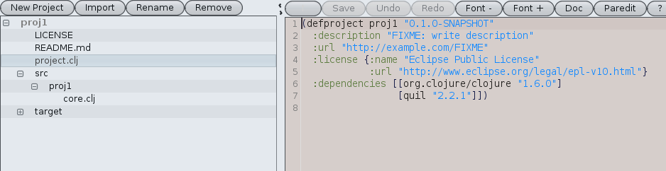

nightcode_screenshots
=====================

Screenshots of all the skins for Nightcode

To start nightcode with a particular skin, use:

<pre>java -jar nightcode-<em>version</em>-standalone.jar --skin <em>name</em></pre>

challenger-deep

dark

emerald-dusk

graphite

graphite-aqua

graphite-glass

magellan

raven

twilight

autumn

business

business-black-steel

business-blue-steel

creme

creme-coffee

dust

dust-coffee

gemini

light

mariner

mist-aqua

mist-silver

moderate

nebula

nebula-brick-wall

sahara

